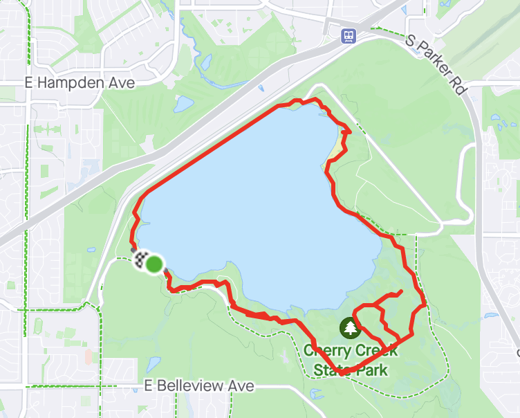
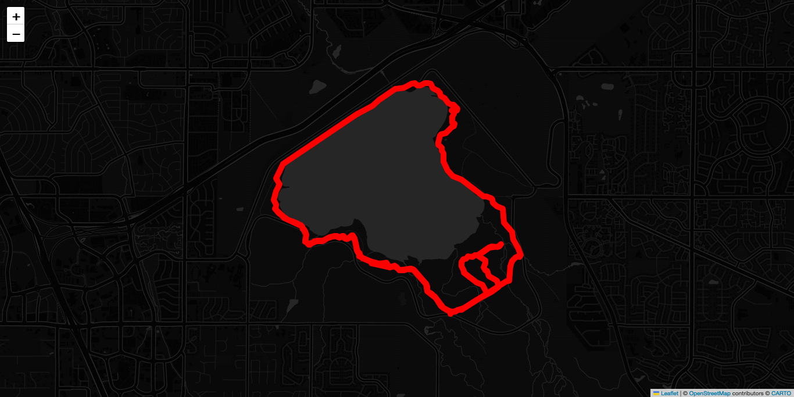

# Quiet Step: Tread Lightly

Little script PoC to ingest a GPX file depicting an activity route and generate an "anonymized png" (that is, one without street names).

Uses gpxpy to parse, folium to generate a leaflet map, neat CartoDB 'no label' map tiles, and selenium to grab the screenshot. Thanks OSS community!

This proves out a potential approach for a little competition for my run club.

## Example

### Strava activity with placenames (see [data/cherry-creek-12-miler.gpx](data/cherry-creek-12-miler.gpx))

### Output with no placenames

